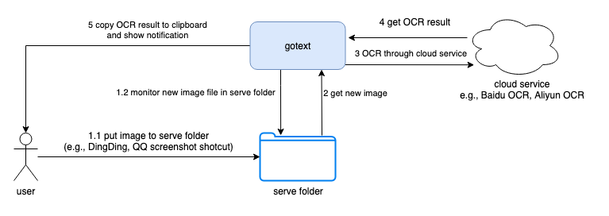

# gotext

A servo service recognizes text from image based on OCR for macOS written in Golang.

# How it works



**Note:** Only [Baidu OCR](https://ai.baidu.com/tech/ocr) is surpported currently, becauase it supplies  500+ free quota/day.

# How to use

## Install

```
go get -u github.com/liudanking/gotext
```

## Configuration 

[Example config file](./cfg/config.json.example):

```json
{
  "serve_dir": "~/Downloads/gotextServeDir",
  "trim_space": true,
  "show_notify": true,
  "ocr_platform": "baidu",
  "baidu_ai_conf": {
    "app_key": "your_app_key",
    "app_secret": "your_app_secret"
  }
}
```
## Start

```
gotext -c your_config_file
```


# Todo

* Support Google Cloud OCR service